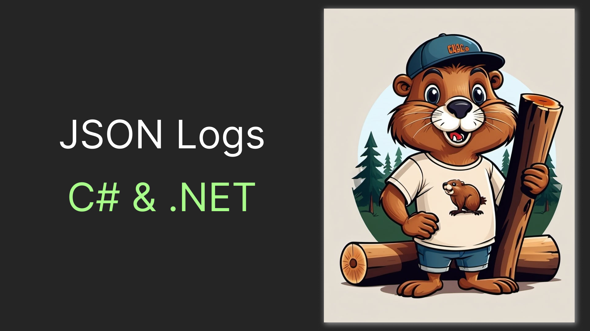

# JSON Logs in C# and .NET

How do you get the most out of your logs? Using structured logs shipped to an observability stack! And perhaps, the most popular shipping format is JSON. Therefore, since .NET 6 we can `AddJsonConsole` as a logging provider. In this article, we will investigate how it works exactly, check out different logs we can get, and learn just one more thing. So, straight to the code!



# The Basics

The logging functionality is not specific to `ASP .NET Core` and works the same for any .NET project type. So let's spin up the most basic project type by running:

```shell
dotnet new console
```

However, unlike with `ASP .NET Core`, console apps don't include functionality out of the box. So we'll need to install a separate nuget package:

```shell
dotnet add package Microsoft.Extensions.Logging.Console
```

Spinning up a logger is a surprisingly twisted process in .NET. In fact, it's twisted so much, that the most simple way to do it is by elaborating `Microsoft.Extensions.DependencyInjection`. Here's what the most basic code looks like:

> The console log provider seems to ship with some sort of delay, so for logs to actually appear we will wait for 100 milliseconds before exiting.

```csharp
using Microsoft.Extensions.DependencyInjection;
using Microsoft.Extensions.Logging;

var logger = new ServiceCollection()
    .AddLogging(l => l.AddJsonConsole())
    .BuildServiceProvider()
    .GetRequiredService<ILogger<Program>>();

logger.LogInformation("{Name} {Age}", "Egor", 27);
await Task.Delay(100); // Wait for logs to be written
```

If we `dotnet run` the code we'll get the following JSON

> This log is formatted for readability. The actual JSON log will be written in a single line. However, you can get the JSON formatted by changing the code to the following: `l.AddJsonConsole(c => c.JsonWriterOptions = new () { Indented = true })`

```json
{
    "EventId": 0,
    "LogLevel": "Information",
    "Category": "object",
    "Message": "Egor 27",
    "State": {
        "Message": "Egor 27",
        "Name": "Egor",
        "Age": 27,
        "{OriginalFormat}": "{Name} {Age}"
    }
}
```

# Nested Objects

Now let's spice things up a little bit! What if don't just log primitives, but some objects? Let's create one:


```csharp
var egor = new Person("Egor", 28);
record Person(string Name, int Age);
```

And to make things even more interesting let's say we have some information that initially came to us as JSON e.g. as a request body and we don't know a type of it. Fortunately, `JsonSerializer` supports deserializing this json as an object, which will actually be a `JsonElement`. Here's how we will imitate that:

```csharp
var hobby = JsonSerializer.Deserialize<object>("{\"Name\":\"Board Games\"}");
```

Logger is happy to accept any object as a parameter, so let's submit our information for it to log:

```cs
logger.LogInformation("{Person} {Hobby}", egor, hobby);
```

This is the log we'll get now:

```json
{
    "EventId": 0,
    "LogLevel": "Information",
    "Category": "Program",
    "Message": "Person { Name = Egor, Age = 28 } {\u0022Name\u0022:\u0022Board Games\u0022}",
    "State": {
        "Message": "Person { Name = Egor, Age = 28 } {\u0022Name\u0022:\u0022Board Games\u0022}",
        "Person": "Person { Name = Egor, Age = 28 }",
        "Hobby": "{\u0022Name\u0022:\u0022Board Games\u0022}",
        "{OriginalFormat}": "{Person} {Hobby}"
    }
}
```

The peculiar thing about this is that we are **not** getting any nested JSON objects. Moreover, we got different representations of `Person` and `hobby`. But if we run `JsonSerializer.Serialize` on those objects we will in fact get them as nested objects. So, what's going on here? To figure this out, let's study the code of the [`JsonConsoleFormatter.cs`](https://github.com/dotnet/runtime/blob/main/src/libraries/Microsoft.Extensions.Logging.Console/src/JsonConsoleFormatter.cs). Here's the important part:

```csharp
private static void WriteItem(Utf8JsonWriter writer, KeyValuePair<string, object> item)
{
  string key = item.Key;
  switch (item.Value)
  {
    case bool flag:
      writer.WriteBoolean(key, flag);
      break;
    case byte num1:
      writer.WriteNumber(key, (int) num1);
      break;
    // 9 different num cases omitted for brievity
    case short num10:
      writer.WriteNumber(key, (int) num10);
      break;
    case ushort num11:
      writer.WriteNumber(key, (int) num11);
      break;
    case null:
      writer.WriteNull(key);
      break;
    default:
      writer.WriteString(key, JsonConsoleFormatter.ToInvariantString(item.Value));
      break;
  }
}

private static string ToInvariantString(object obj)
{
  return Convert.ToString(obj, (IFormatProvider) CultureInfo.InvariantCulture);
}
```

What this essentially means is that if we don't recognize an item as a primitive type we will just run a `ToString()` on it and return the received value, not allowing a complex analysis on nested data.

## Can we do better?

Fortunately, there's another nuget called `Astor.Logging` providing us with another version of JSON Console logging out. Let's check it out!

```shell
dotnet add package Astor.Logging
```

The package is fully compatible with Microsoft's dependency injection system, so the only line we will need to change is this:

```csharp
.AddLogging(l => l.AddMiniJsonConsole())
```

> Plus, add `using Astor.Logging`, of course.

And here's what we get with that package right away:

```json
{
    "person": {
        "name": "Egor",
        "age": 28
    },
    "hobby": {
        "Name": "Board Games"
    }
}
```

So now, we don't just get the nested objects. We also made our significantly more minimalistic, hence the `Mini` in the name. But what if we need some metadata? Let's use `IncludeAll` in the logger configuration. Also, notice that the logger using a camel case by default. This can also be configured with `SetNamingPolicy`. Let's use `JsonNamingPolicy.KebabCaseLower` just for fun. And finally, let's `Indent` this thing. So here's the code we got:

```csharp
    .AddLogging(l => l.AddMiniJsonConsole(j => 
        j.IncludeAll().Indent().SetNamingPolicy(JsonNamingPolicy.KebabCaseLower)))
```

And here's the log:

> Note that for `hobby` initial json casing is preserved.

```json
{
  "person": {"name":"Egor","age":28},
  "hobby": {"Name":"Board Games"},
  "log-original-format": "{Person} {Hobby}",
  "log-category-name": "Program",
  "log-level": "Information",
  "log-event-id": 2,
  "log-message": "Person { Name = Egor, Age = 28 } {\u0022Name\u0022:\u0022Board Games\u0022}"
}
```

# Wrapping Up

Adding JSON logs in a .net application is as easy as

```csharp
logging.AddJsonConsole();
```

However, you'll get a log overstuffed with metadata and with no nesting capabilities

```json
{
  "EventId": 0,
  "LogLevel": "Information",
  "Category": "object",
  "Message": "Egor { Name = Board Games, Favorite = Resistance }",
  "State": {
    "Message": "Egor { Name = Board Games, Favorite = Resistance }",
    "Name": "Egor",
    "Hobby": "{ Name = Board Games, Favorite = Resistance }",
    "{OriginalFormat}": "{Name} {Hobby}"
  }
}
```

But to get a minimalistic log with inner objects where you need them, like:

```json
{
  "name": "Egor",
  "hobby": {"name":"Board Games","favorite":"Resistance"}
}
```

You'll just need to 

```sh
dotnet add package Nist.Logs
``` 

And update your code to

```csharp
logging.AddMiniJsonConsole();
```

...

By the way... 👉👈

Clap along if you feel like you'll use the JSON logs 👏
